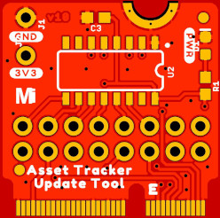

# MicroMod Asset Tracker Firmware Update Tool

A dummy Processor Board which will simplify firmware updates for the SARA-R5 on the Asset Tracker Carrier Board.

The board carries a CH340C USB-Serial converter to act as the bridge between the USB-C interface on the carrier board and the 8-wire UART interface on the SARA-R5.

Power for the SARA can be enabled via a push-button on the carrier board.

The firmware can be updated with [EasyFlash](https://www.u-blox.com/sites/default/files/SARA-R5-FW-Update_AppNote_%28UBX-20033314%29.pdf).

The tool will also make it easy for anyone wanting to use [m-center](https://www.u-blox.com/en/product/m-center) to communicate with the SARA.

## Repository Contents

- **/Hardware** - Eagle PCB, SCH and LBR design files
- **LICENSE.md** contains the licence information
