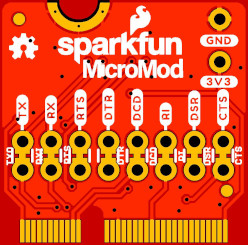

# MicroMod Asset Tracker Firmware Update Tool

A dummy Processor Board which will simplify firmware updates for the SARA-R5 on the Asset Tracker Carrier Board.

The board carries a CH340G USB-Serial converter to act as the bridge between the USB-C interface on the carrier board and the 8-wire UART interface on the SARA-R5.

Power for the SARA can be enabled via a push-button on the carrier board.

## Repository Contents

- **/Hardware** - Eagle PCB, SCH and LBR design files
- **LICENSE.md** contains the licence information
